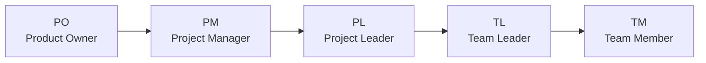
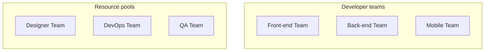
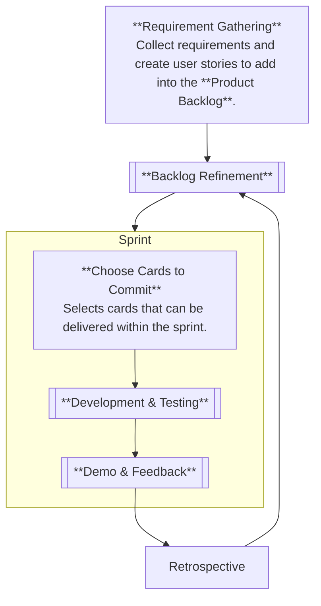
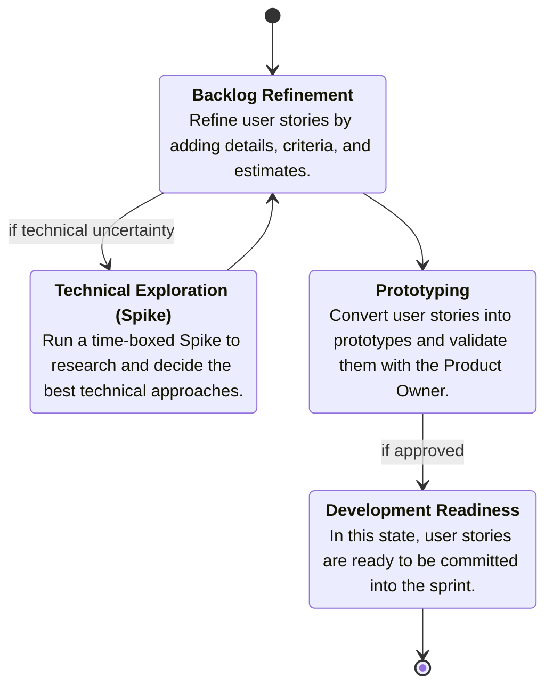
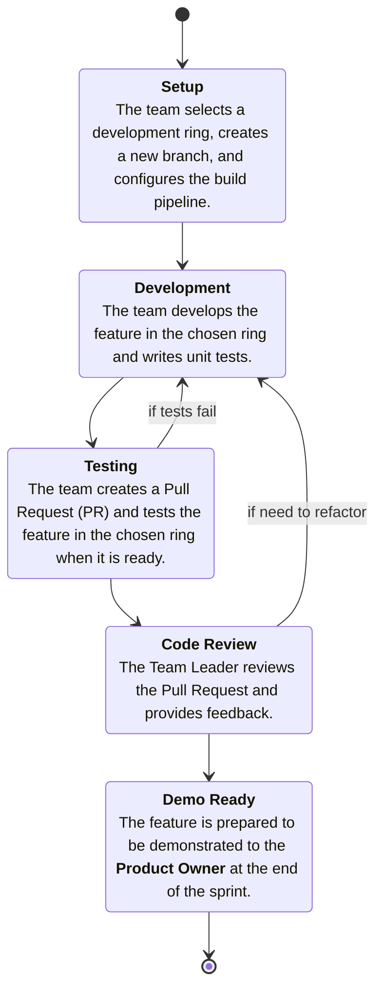
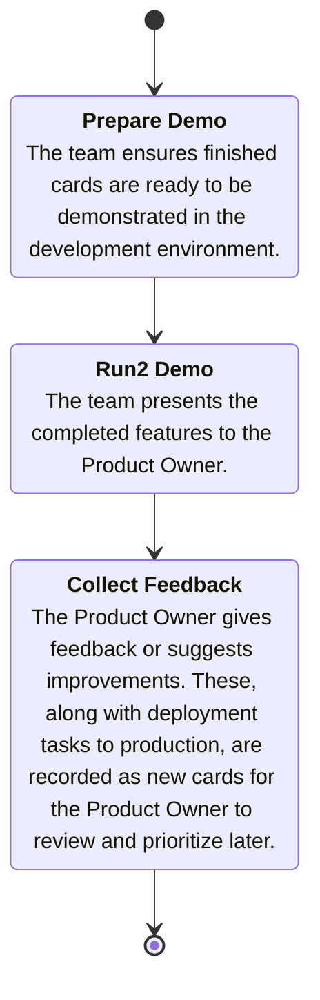

# Employee Handbook
A guide that explains a company’s policies, rules, and workplace practices to help employees understand their rights, responsibilities, and work culture.

## Table of Contents
- [Employee Handbook](#employee-handbook)
  - [Table of Contents](#table-of-contents)
- [Roles \& Jobs](#roles--jobs)
  - [Roles](#roles)
  - [Jobs](#jobs)
- [Development process](#development-process)
  - [Overview](#overview)
  - [Product backlog](#product-backlog)
  - [Backlog Refinement](#backlog-refinement)
  - [Development \& Testing](#development--testing)
  - [Demo \& Feedback](#demo--feedback)
- [⌛Pending documents](#pending-documents)

# Roles & Jobs

> NOTE  
> In each project, roles may change depending on what best fits the project’s needs.

## Roles

The responsibilities or "hats" you take on within a team or project, which may shift depending on the situation.

| Role | Description |
|------|-------------|
| Product Owner | Defines the product vision and prioritizes the backlog. |
| Project Manager | Manages timelines, resources, and cross-team communication. |
| Project Leader | Understands project goals, ensures project plans are delivered, provides solutions and guidance to the team, aligns their efforts, and oversees planning and progress tracking. |
| Team Leader | Guides the team in best practices, addresses challenges, and regularly updates the *Project Leader*. |
| Team Member | Contributes to the project by completing assigned tasks and collaborating with others. |

## Jobs

The position you're hired for, responsible for specific tasks that contribute to completing the project the team is working on.

| Team | Type | Description |
|------|------|-------------|
| Designer Team | Resource Pool | Creates the visual and interactive elements of the product. |
| DevOps Team | Resource Pool | Focuses on automating and optimizing the development and deployment processes. |
| QA Team | Resource Pool | Ensures the product meets quality standards through testing. |
| Front-end Team | Developer Team | Implements the user interface and ensures a seamless user experience. |
| Back-end Team | Developer Team | Works on server-side logic, databases, and APIs. |
| Mobile Team | Developer Team | Specializes in building applications for mobile devices.

# Development process

We follow **Agile** practices with incremental development and continuous feedback to guide our process.

## Overview

## Product backlog
It is the master prioritized to-do list for a product, representing everything that may be needed to improve, build, deploy, or maintain it.

## Backlog Refinement

It is the process of reviewing and improving backlog items by adding details & acceptance criteria, clarifying requirements, estimating effort, and re-prioritizing so they are ready for upcoming sprints.

## Development & Testing

Building features, writing tests, reviewing code, and validating functionality for delivery.

## Demo & Feedback

Show finished work to the **Product Owner** for review and feedback.

# ⌛Pending documents
1. Sprint planning
2. Team meetings
3. Cross-team collaboration
4. Daily routine
5. TBD