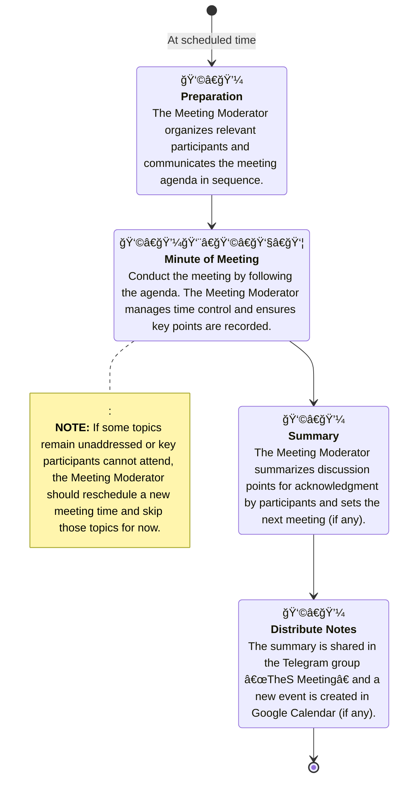

# Meeting

It is a process for organizing and conducting meetings effectively, ensuring clear communication, documentation, and follow-up actions.

## Workflow Process

## Relevant Roles

| Role               | Description                                                                 | Duties                                                                                                    |
|--------------------|-----------------------------------------------------------------------------|-----------------------------------------------------------------------------------------------------------|
| 👩‍💼 Meeting Moderator  | Person responsible for organizing and controlling the meeting.              | Set topics, invite participants, moderate the session, summarize outcomes, schedule the next meeting.     |
| 👨‍👩‍👧‍👦 Participants       | Individuals related to the meeting topics or invited to join the meeting. | Prepare in advance, review documents, draft questions or suggestions, contribute to actionable outcomes.  |

### Meeting Moderator Assignment
คนที่ทำหน้าที่เป็น Meeting Moderator ในแต่ละกระประชุมจะแตกต่างกันออกไป ขึ้นอยู่กับว่าเป็นประชุมอะไร เช่น

| NO | Meeting Type        | Meeting Moderator        |
|----|---------------------|--------------------------|
| 1  | Team Meeting        | Team Leader              |
| 2  | Cross-team Meeting  | Monthly Assigned Person  |
| 3  | Team Leader Meeting | Weekly Assigned Leader   |

## Base KPIs

| NO | KPI                     | Description                                                     | Target |
|----|-------------------------|-----------------------------------------------------------------|--------|
| 1 | Punctuality   | Meetings start and end on the scheduled time                    | 90%    |
| 2 | Attendance Rate | Percentage of participants attending the meeting                | 90%    |
| 3 | Notes Delivery  | Meeting Moderator delivers meeting notes within 24 hours after the session         | 100%   |