# Meeting

It is a process for organizing and conducting meetings effectively, ensuring clear communication, documentation, and follow-up actions.

## Workflow Process

```mermaid
stateDiagram-v2

  MeetingModerator: 👩‍💼 Meeting Moderator
  state MeetingModerator {
    [*] --> Preparation: At scheduled time
    Preparation: **Preparation**<br/>Prepare the meeting by inviting the relevant participants, presenting the agenda topics in order, and specifying the meeting duration.
    MOM: **Minute of Meeting**<br/>Conduct the meeting by following each agenda item in order, managing the time, and recording key points for each topic.
    Summary: **Summary**<br/>The Meeting Moderator summarizes discussion points for acknowledgment by participants and sets the next meeting (if any).
    DistributeNotes: **Distribute Notes**<br/>The summary is shared in the Telegram group **TheS Meeting** and a new event is created in Google Calendar (if any).
    check: Finished all agendas or Time's up?
    state if_state <<choice>>
  }

  Participants: 👨‍👩‍👧‍👦 Participants
  state Participants {
    EachAgenda: **Start an Agenda**<br/>The agenda owner presents the prepared topics to reach a conclusion or gather additional information within the allotted time.
  }

  Preparation --> MOM
  MOM --> check
  check --> if_state
    if_state --> Summary : Yes
    if_state --> EachAgenda: No
  %%s2 --> Participants
  EachAgenda --> MOM: Meeting concluded or Time’s up
  %%s2 --> s3: Time's up or finished all agendas
  Summary --> DistributeNotes
  DistributeNotes --> [*]

  note right of Participants
    **NOTE:** If some topics remain unaddressed or key participants cannot attend, the Meeting Moderator should reschedule a new meeting time and skip those topics for now.
  end note
```

## Relevant Roles

| Role               | Description                                                                 | Duties                                                                                                    |
|--------------------|-----------------------------------------------------------------------------|-----------------------------------------------------------------------------------------------------------|
| 👩‍💼 Meeting Moderator  | Person responsible for organizing and controlling the meeting.              | Set topics, invite participants, moderate the session, summarize outcomes, schedule the next meeting.     |
| 👨‍👩‍👧‍👦 Participants       | Individuals related to the meeting topics or invited to join the meeting. | Prepare in advance, review documents, draft questions or suggestions, contribute to actionable outcomes.  |

### Meeting Moderator Assignment
The person acting as Meeting Moderator varies by meeting, depending on the type of meeting, for example

| NO | Meeting Type        | Meeting Moderator        |
|----|---------------------|--------------------------|
| 1  | Team Meeting        | Team Leader              |
| 2  | Cross-team Meeting  | Monthly Assigned Person  |
| 3  | Team Leader Meeting | Weekly Assigned Leader   |

## Base KPIs

In each meeting round, the effectiveness of meetings will be measured using the criteria in the table below.

| NO | KPI                     | Description                                                     | Target |
|----|-------------------------|-----------------------------------------------------------------|--------|
| 1 | Punctuality   | Meetings start and end on the scheduled time                    | 90%    |
| 2 | Attendance Rate | Percentage of participants attending the meeting                | 90%    |
| 3 | Notes Delivery  | Meeting Moderator delivers meeting notes within 24 hours after the session         | 100%   |

When a KPI is not met, the Meeting Moderator should analyze the cause and implement improvements in future meetings.